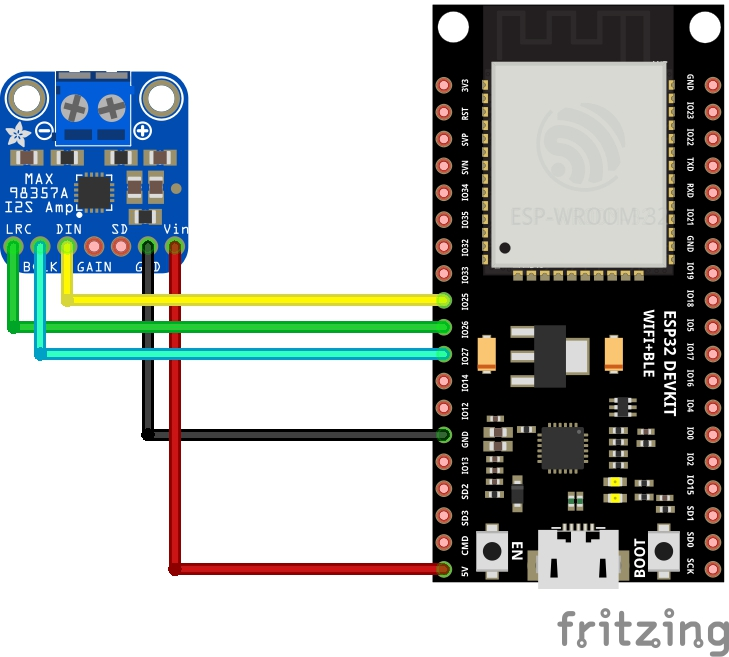
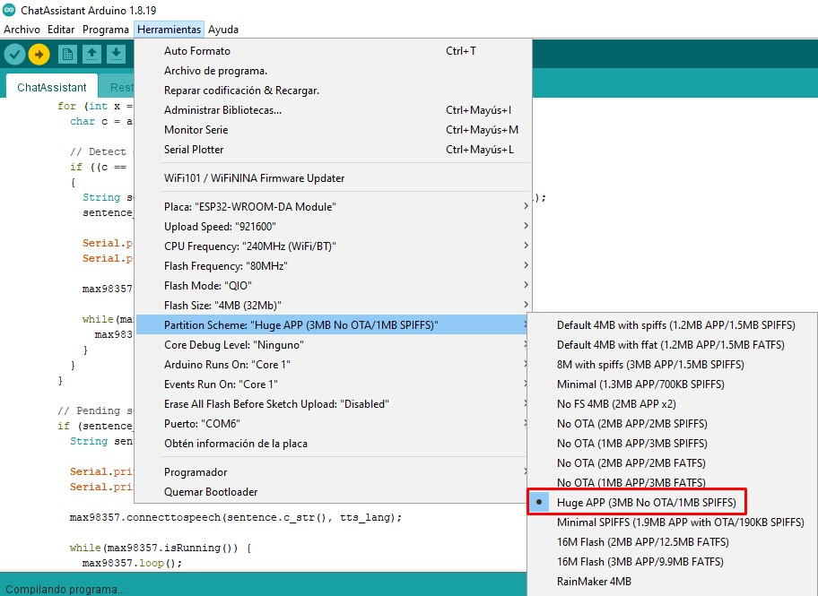

# Serial port communication with audio out

This is the simplest project. We simply write our question in the **Serial Monitor** and we get the answer through a speaker.

Not much going on here but it is a nice project to understand how the full project began. Probably a simple enough project if you are starting with ESP32 and AI.

# Connections

The Sketch will set the following pins:

- MAX98357 DIN to ESP32 GPIO25.
- MAX98357 LRC to ESP32 GPIO26
- MAX98357 BCLK to ESP32 GPIO27

# Libraries 

In order to compile this project you will need to import the libraries [ArduinoJSON](https://github.com/bblanchon/ArduinoJson) and [ArduinoStreamUtils](https://github.com/bblanchon/ArduinoStreamUtils).

We will also need [ESP32-audioI2S](https://github.com/schreibfaul1/ESP32-audioI2S) for our **MAX98357 I2S Amplifier**.

The audio library is really big so you must change the **Partion Scheme** in rder for the sketch to fit. Set it to **Huge App**.

# Configuration
Open **config.h** file and setup your WiFi and OpenAI/Ollama settings.

# Known issues
Some times the TTS servers will stop producing audio if the audio output is too big. 
To solve this issue I have cut the reply into sentences and sentences may be further cut down by commas, semicolon, etc. by setting the value of **max_sentence_length** in the config file.
However, the best audio result is with this value to 0 (Zero).
Even if we set the value to a really low number of characters, sometime the LLM will produce a sentence with no punctuation and audio will stop abruptlly.
